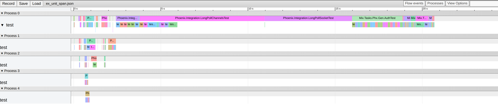

# ExUnitSpan

A formatter for ExUnit that helps visualize the test execution and
find bottlenecks in your test suite.




## Installation

```elixir
def deps do
  [
    {:ex_unit_span, "~> 0.1.0", only: :test}
  ]
end
```

## Usage

```bash
mix test --formatter ExUnitSpan
```

This should generate `ex_unit_span.json` file in the current
folder. Open `chrome://tracing` in chrome browser and drop the json
file.
